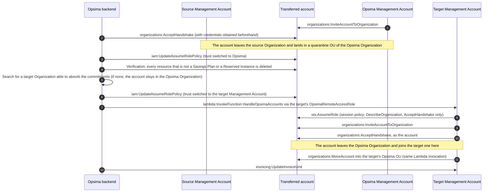

# Account transfer

A transfer moves a dedicated account, and the commitments it holds, from one customer's Organization to
another's. It is triggered by Opsima's optimisation engine when the source Organization is over-reserved.
The account never moves directly between two customers: it always passes through the Opsima
Organization, where it is verified and cleaned of anything other than Savings Plans and Reserved
Instances before being invited into the target Organization.

## What each side sees

- **Source Organization**: one `AssumeRole` on `OpsimaRemoteAccessRole`, then the account leaving the
  Organization. No `RemoveAccountFromOrganization` or `LeaveOrganization` call is ever made. The trust policy
  of the account's Opsima role is only modified once the account is in the Opsima Organization: nobody can
  change it while the account is a member of yours, which is why the SCP does not allow
  `iam:UpdateAssumeRolePolicy`.
- **Target Organization**: one `AssumeRole`, one Lambda invocation, then `InviteAccountToOrganization`,
  `AcceptHandshake`, `MoveAccount` and `UpdateInvoiceUnit`. The account sits at the root for a few seconds
  before the move; the Lambda reports any failure to Opsima, which retries.

Before accepting, the Lambda checks with the account's own credentials that it is a member of the Opsima
Organization, which guarantees it has gone through the cleaning step. A transfer takes about two minutes
end to end, almost all of it waiting for the account to become visible in the receiving Organization.
